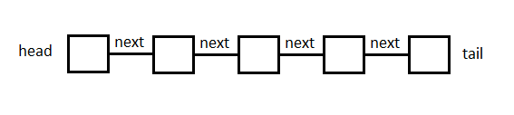

# Linked List

## Overview

A Linked List is a powerful data structure. It is a little more maleable than a Queue and Stack and is doesn't have a strict insert-remove order like they do (FIFO, FILO). This data structure can be very useful for building other data structures and customizing them do what you need.

When I think of a Linked List I think of white board markers. You can attach them to each other on either the front or the end. This makes it possible to create a length of several of them connected to each other. With these markers, there isn't anything stopping you from adding another one on the end, at the front, or anywhere in between. That is how Linked Lists are. We can easily add items on the front, back, and with maybe a little more work, we can add them anywhere in the middle as well. Each one links to two surrounding them which makes for easy iteration as well.



## Common Operations

**_insert_head(value) & insert_tail(value):_** These operations add a new node with the passed in value to the front or back of the Linked List. They are both O(1) since they will only adjust the pointers add the head or tail. No iteration or moving of nodes is necessary while performing either of these.

**_insert(index, value):_** This operation adds a new node with the passed in value after node 'index'. Since this method involves finding a specific node within the linked list, it will need to iterate through the nodes until it finds the correct one. We cannot be sure where that node will be so this operation has O(n) where n is the number of nodes that must be checked before finding the correct one.

**_remove_head() & remove_tail(index):_** These operations remove a node from front or back of the Linked List. They are both O(1) since they will only adjust the pointers add the head or tail to exclude the node. No iteration or moving of nodes is necessary while performing these operations.

**_remove(index):_** This operation removes a new node with the passed in value after node 'index'. Since this method involves finding a specific node within the linked list, it will need to iterate through the linked list until it finds the correct node. We cannot be sure where that node will be so this operation has O(n) where n is the number of nodes that must be checked before finding the correct one.

**_size():_** This operation will return teh size of the Linked List. The time complexity of this operation is O(1).

**_empty():_** This operation will return true if the Linked List is empty and false if there is at least on value. This operation simply compares the size of the Linked List to zero. It's time complexity is O(1).

## Example Problem

Linked Lists are sometimes used to implement other data structures. Take the Queue for example. The built in queue class in Python does not use a Linked List and as a result the dequeue function has a time complexity of O(n). When implementing this data structure using a Linked List, however, the time complexity of the dequeue function can be reduced to O(1).

This is an example of a basic Queue being implemented using a Linked List.

```python
class Node():

    def __init__(self, data) -> None:
        """
            Initialize a new node
        """
        self.data = data
        self.next = None


class Linked_List():

    def __init__(self) -> None:
        """
            Initialize an empty linked list
        """
        self.head = None
        self.tail = None

    def add_tail(self, data) -> None:
        """
            Insert a node at the tail
        """
        new_node = Node(data)

        # check if the linked list is empty
        if self.is_empty():
            self.tail = new_node
            self.head = new_node
        else:
            self.tail.next = new_node
            self.tail = new_node

    def remove_head(self):
        """
            Remove the node at the head
        """
        # check if linked list is empty
        if self.is_empty():
            print('Unable to remove item')
            return
        else:
            curr = self.head
            self.head = curr.next
            return curr.data

    def is_empty(self) -> bool:
        """
            Check if the linked list is empty
        """
        if self.head == None:
            return True

        return False

    def __str__(self):
        """
        Return a string representation of the linked list.
        """
        output = ""
        first = True
        curr = self.head
        while curr is not None:
            if first:
                first = False
            else:
                output += ", "
            output += str(curr.data)
            curr = curr.next
        return output


class Queue():

    def __init__(self) -> None:
        """
            Initialize a new queue
        """
        self.queue = Linked_List()

    def enqueue(self, data):
        """
            Add an item to the queue
        """
        self.queue.add_tail(data)

    def dequeue(self):
        """
            Remove the next item from the queue
        """
        return self.queue.remove_head()

    def is_empty(self):
        """
            Check if the queue is empty
        """
        return self.queue.is_empty()

    def __str__(self):
        """
            Display the contents of the queue
        """
        return 'Contents of queue: ' + str(self.queue)


queue = Queue()
queue.enqueue('hello')
print('Added \'hello\' to queue')
queue.enqueue('world')
print('Added \'world\' to queue')
print(queue)
print('Removed \'' + queue.dequeue() + '\' from queue')
queue.enqueue(5)
print('Added \'5\' to queue')
queue.enqueue(0)
print('Added \'0\' to queue')
print(queue)
print('Removed \'' + queue.dequeue() + '\' from queue')
print(queue)
```

Result:

```
Added 'hello' to queue
Added 'world' to queue
Contents of queue: hello, world
Removed 'hello' from queue
Added '5' to queue
Added '0' to queue
Contents of queue: world, 5, 0
Removed 'world' from queue
Contents of queue: 5, 0
```

## Problem

Use a linked list to build a music playlist with next, previous, add, and remove functionality. Here are a few requirements:

- Each node within the linked list should have a next and previous pointer.
- Performing a previous operation while at the head should move you to the tail and vice versa.
- Functionality to add a song to the playlist.
- Functionality to remove the current song from the playlist.

Some code is provided for you to start with:

```python
class Song:

    def __init__(self, name) -> None:
        """
            Initialize a new song for the playlist
        """
        # Code for the song here
        pass


class Playlist:

    def __init__(self) -> None:
        """
            Initialize a new playlist
        """
        # Code for creating a playlist here
        pass

    def move_next(self) -> Song:
        """
            Move to the next Song
        """
        # Code for moving to the next song here
        pass

    def move_prev(self) -> Song:
        """
            Move to the previous Song
        """
        # Code for moving to the previous song here
        pass

    def add(self, song):
        """
            Add a new Song to the tail
        """
        # Code for adding a new song here
        pass

    def remove(self, song):
        """
            Remove the current Song
        """
        # Code for removing the current song here
        pass

    def get_curr_song(self):
        """
            Return the current song
        """
        pass


# Create a new playlist
playlist = Playlist()

# Control when the user is finished
done = False

while not done:
    # Code to get the current song

    # Menu
    print('Current song: ')
    print('1. Next song')
    print('2. Previous song')
    print('3. Add song')
    print('4. Remove current song')
    print('5. Quit')
    option = int(input('> '))

    # Add code within each if and
    # elif to handle the users input

    if option == 1:
        pass
    elif option == 2:
        pass
    elif option == 3:
        pass
    elif option == 4:
        pass
    elif option == 5:
        print('Goodbye')
        done = True
```

You can find a possible solution here: [Solution Code](playlist-solution.py)
