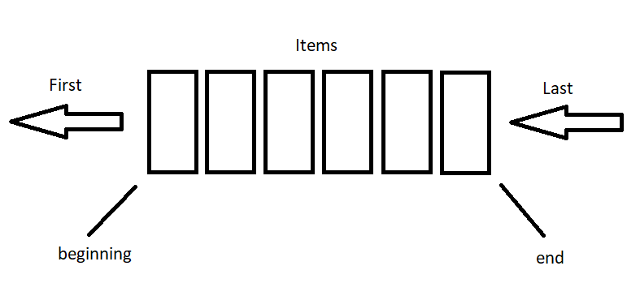

# Queue

## Overview

This data structure is FIFO (First In, First Out). When thinking about this data structure, I think of a conveyor belt. As you add an object to the conveyor belt it will move along till it exits. There isn't a way for the object to pass the other objects in front of it, it must continue along until it has exited. A queue works this way.

When removing an item from a queue, you will remove the item that was added first or the item that has been in the queue the longest. When adding to the queue, the item being added will always be added on the end and won't be removed until all the items preceding it have been removed.



## Common Operations

**_enqueue(value):_**
This operation adds an item to the end of the queue. The time taken to perform this operation is O(1) since we are simply adding an item to the end of the queue.

**_dequeue():_** This operation removes the first item from the queue. This should be the item that has been in the queue the longest. The time taken to perform this operation is O(n) since we must remove the first item from the queue and move each item 'forward.'

**_size():_** This operation returns the size of the queue. The time taken for this operation is O(1).

**_empty():_** This operation returns true if the queue is empty and false if there is at least one item inside. The time taken for this operation is O(1).

## Example Problem

You are working with a ticketing system and need to update the tickets status when they are marked complete. The rate at which you receive tickets could vary so you need some way to store the tickets when they come in as the program can only handle one at a time. To solve this problem we can implement a queue to store the tickets waiting to be completed.

Using a queue to solve this issue:

```python
# used to store the tickets since we aren't receiving any actual tickets
tickets = [
    {'id': '0', 'requestor': 'Joe', 'complete': 'true', 'status': 'new'},
    {'id': '1', 'requestor': 'Matthew', 'complete': 'true', 'status': 'new'},
    {'id': '2', 'requestor': 'Katelyn', 'complete': 'true', 'status': 'new'},
    {'id': '3', 'requestor': 'Eliza', 'complete': 'true', 'status': 'new'},
    {'id': '4', 'requestor': 'Steve', 'complete': 'true', 'status': 'new'},
    {'id': '5', 'requestor': 'Jen', 'complete': 'true', 'status': 'new'},
    {'id': '6', 'requestor': 'Mark', 'complete': 'true', 'status': 'new'},
    {'id': '7', 'requestor': 'Bill', 'complete': 'true', 'status': 'new'},
]

# We will use a python list to demonstrate basic queue operations
queue = []
# simulate receiving of tickets


def close_ticket(ticket):
    """
        try to change a tickets status to closed,
        return true upon success and false upon failure
    """
    try:
        ticket['status'] = 'closed'
        print(ticket['id'], 'closed')
        return True
    except:
        print('Unable to close ticket')
        return False


# we receive the first ticket and add it to the queue
queue.append(tickets[0])
print('Ticket ' + tickets[0]['id'] + ' received')

# perform the operation on the first item in the queue
ticket = queue[0]
if close_ticket(ticket):
    del queue[0]

# simulate receivng two tickets before the first can be completed and removed
queue.append(tickets[1])
print('Ticket ' + tickets[1]['id'] + ' received')
queue.append(tickets[2])
print('Ticket ' + tickets[2]['id'] + ' received')

# perform operation on the first ticket in queue
ticket = queue[0]
if close_ticket(ticket):
    del queue[0]

# simulate receiving another ticket before the operation completes
queue.append(tickets[3])
print('Ticket ' + tickets[3]['id'] + ' received')

ticket = queue[0]
if close_ticket(ticket):
    del queue[0]

ticket = queue[0]
if close_ticket(ticket):
    del queue[0]

queue.append(tickets[4])
print('Ticket ' + tickets[4]['id'] + ' received')

queue.append(tickets[5])
print('Ticket ' + tickets[5]['id'] + ' received')

queue.append(tickets[6])
print('Ticket ' + tickets[6]['id'] + ' received')

ticket = queue[0]
if close_ticket(ticket):
    del queue[0]

ticket = queue[0]
if close_ticket(ticket):
    del queue[0]

queue.append(tickets[7])
print('Ticket ' + tickets[7]['id'] + ' received')

ticket = queue[0]
if close_ticket(ticket):
    del queue[0]

ticket = queue[0]
if close_ticket(ticket):
    del queue[0]

```

Result:

```
Ticket 0 received
0 closed
Ticket 1 received
Ticket 2 received
1 closed
Ticket 3 received
2 closed
3 closed
Ticket 4 received
Ticket 5 received
Ticket 6 received
4 closed
5 closed
Ticket 7 received
6 closed
7 closed
```

From the result we can see how using a queue in this scenario makes it possible for us to store data that needs to be operated on but must wait for our program to complete it's current operation.

## Problem

You are building a program to help a company manage tasks. They would like a program that they can add tasks that need to completed for each person, and as they are completed they are removed from the list of tasks to be completed. Implement a queue to solve this issue. Here are a few requirements:

- Adding a task should add it to the end of the queue.
- Completing a task should remove the first item from the queue.
- Function to get the current number of tasks in the queue.
- Function that will display each task in the queue

Some code is provided for you to start with:

```python
print('Task Manager 1.0')
done = False


def add_task(task):
    """
        Add a task to the end of the queue
    """
    pass


def complete_task():
    """
        Remove the next task in the queue
    """
    pass


def total_tasks():
    """
        Return the size of the queue
    """
    pass


def display_queue():
    """
        Display each task in the queue
    """
    pass


while not done:
    print('1. Add task')
    print('2. Complete next task')
    print('3. View total number of tasks')
    print('4. View queue')
    print('5. Quit')

    option = int(input('Enter a number (1-4)\n> '))

    if option == 1:
        task_name = input('Enter name of task: ')
        add_task(task_name)
    elif option == 2:
        complete_task()
    elif option == 3:
        total = total_tasks()
        print(total)
    elif option == 4:
        display_queue()
    elif option == 5:
        print('goodbye')
        done = True

```

You can find a possible solution here: [Solution](task-manager-solution.py)
