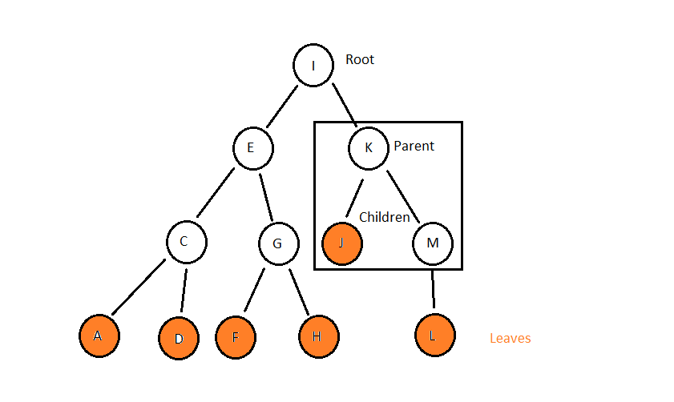

# Tree

## Overview

A tree data structure is pretty much exactly what it sounds like. It consists of a root and from the root branches go off in different directions. Like linked lists, trees utilize pointers connecting different nodes. Unlike linked lists, however, a single node in a tree can be connected to mutliple other nodes. This allows for smarter storing of data because you have a little bit more organization you can do based on how you have your tree set up.

Here's an example of a simple tree with some important keywords:


In this image we have a simple tree that stores letters of the alphabet. The root is the first element of the tree and in this case it is the letter I. This tree is organized in such a way so that any letter that comes before I in the alphabet always goes to the left of the node being evaluated. For example, if I wanted to add the letter B (which is absent) I would start at the root and ask "does A come before or after I in the alphabet?" Since it comes after, I would move to the left child of the letter I which is the letter E. I would ask the same question again all the way till I got to the letter A. Here I would ask the same question but the response would be different. B comes before A in the alphabet so B would be placed as the right child of A. This kind of tree is relatable to a Binary Search Tree. The main difference is that a BST is often filled with numbers instead of letters so the comparisons are greater than or less than instead of before or after.

You may have a different structure to your tree depending on how you set up the logic. Two basic types of trees are:

- Binary Search Tree: Places values that are less than the root to the left and values that are greater to the right.

- Balanced Binary Search Tree: This tree is a Binary Search Tree that has been balanced, meaning that the left and right subtrees do not have a height difference greater than 1. This can be very useful for searching for stored values quickly.

## Common Operations:

These are some common operations that are helpful to know when working with a tree.

**_insert(value):_** This operation allows you to add a value into the tree. It will search the tree using recursion to find the position it fits in based on the structure of the tree. This operation is O(log n) since the tree is essentially being divided in half with each recursive call.

**_remove(value):_** This operation will remove a node with the given value from the tree. It also searches the tree for this value using recursion. The time complexity of this operation is O(log n) since it divides the tree or sub-tree it's searching in half with each recursive call.

**_contains(value):_** This function is used to determine whether a given value is within the tree. Just like _insert(value)_ and _remove(value)_ it searches through the tree using recursion and has time complexity of O(log n).

**_traverse_forward():_** This operation will recursively move through the entire tree starting with the left-most subtree and moving right. The time complexity of this operation is O(n) since it will visit every node within the tree.

**_traverse_reverse():_** This operation will recursively move through the entire tree starting with the right-most subtree and moving left. The time complexity of this operation is O(n) since it will visit every node within the tree.

**_height(node):_** This operation returns the height of a given node within the tree. When given the root of the tree it will return the height of the tree. This could be useful to know when ebalancing is needed. The time complexity for this function is O(n) since it will visit every node under it to determine which side of the tree is higher.

**_size():_** This operation will return the total size of the tree. Since this is often stored within the tree itself, the time complexity is O(1).

**_empty():_** This operation will return true if the root is none and false if there is a node found at the root. This operation is O(1) because you only need to check the root.

## Example

This is an example of a very simple Tree data structure. Here we can put in multiple strings and this will place them on the right and left of the first string depending on where they fall in the alphabet. For example, if the first word was "middle" and the second word you put in was "no", then "no" would be a right child of "middle". It would fall on the right side of the tree as a direct child of middle.

```python
class Word:
    def __init__(self, word) -> None:
        self.word = word
        self.parent = None
        self.right_child = None
        self.left_child = None


class Tree:

    def __init__(self) -> None:
        self.root = None

    def insert(self, word):
        """
            Insert a new word into the tree
        """
        # if the tree is empty, set the root to the word
        if self.root is None:
            self.root = Word(word)
        # otherwise, insert it somewhere in the tree.
        else:
            self._insert(word, self.root)

    def _insert(self, word, node):
        """
            Insert the new word in the correct spot.
        """
        # if the word comes before the current node.word
        if word < node.word:
            # if the next node is not yet set up, insert the word
            if node.left_child is None:
                node.left_child = Word(word)
                node.left_child.parent = node

            # move into the left child
            else:
                self._insert(word, node.left_child)
        # if the words comes after the current node.word
        elif word > node.word:
            # if the next node is empty
            if node.right_child is None:
                node.right_child = Word(word)
                node.right_child.parent = node

            # move into the right child
            else:
                self._insert(word, node.right_child)

        elif word == node.word:
            print(word, 'is already in tree.')

    def __iter__(self):
        """
            Iterate through every item in the tree.
        """
        yield from self._traverse_forward(self.root)

    def _traverse_forward(self, node):
        """
            Move down the tree by one node. Used to go through
            every item in the tree and return it's value.
        """
        if node is not None:
            # left side first
            yield from self._traverse_forward(node.left_child)
            yield node.word
            # then the right side
            yield from self._traverse_forward(node.right_child)


alphabet_tree = Tree()
alphabet_tree.insert('Middle')
alphabet_tree.insert('No')
alphabet_tree.insert('Llama')
alphabet_tree.insert('No')
alphabet_tree.insert('Apple')
alphabet_tree.insert('Banana')
alphabet_tree.insert('Zoo')
alphabet_tree.insert('Oregon')

for word in alphabet_tree:
    print(word)

```

Result:

```
No is already in tree.
Apple
Banana
Llama
Middle
No
Oregon
Zoo
```

## Problem

Use a tree data structure to construct a method for saving students profiles that include their name and the grade they have received. Build a balancing system so that the mean grade is always the root of the tree making the tree balanced. A few requirements to keep in mind:

- Able to add and display both a name and grade for each student.
- Use recursion to add a new student.
- Build functionality to balance to the tree after every addition.

Strecth Challenge (no soultion provided):

- Add functionality to remove a student from the tree.

Here is some code to get you started:

```python
class Student:
    def __init__(self, name, grade):
        """
            Create an instance of a student with a name and grade.
        """
        pass


class Student_Directory:
    def __init__(self):
        """
            Create a directory (tree) to store all the Student objects
        """
        pass

    def insert(self, name, grade):
        """
            Insert a new student into the directory
        """
        pass

    def _insert(self, curr_student, name, grade):
        """
            Add a new student to the directory. Will recusively search
            the tree until correct placement is found.
        """
        pass

    def __iter__(self):
        """
            Iterate through every item in the tree.
        """
        yield from self._traverse_forward(self.root)

    def _traverse_forward(self, curr_student):
        """
            Move down the tree by one student. Used to go through
            every item in the tree and return it's value.
        """
        if curr_student is not None:
            # left side first
            yield from self._traverse_forward(curr_student.left)
            yield curr_student
            # then the right side
            yield from self._traverse_forward(curr_student.right)


def balance_directory(list):
    """
        Create a student directory that is balanced based on grades
        using a sorted listed.
    """
    pass


def insert_from_middle(list, i_first, i_last, directory):
    """
        Find the middle element in the list and insert it into the
        directory. Will run recursively until all elements in the
        list have been added to the directory.
    """
    pass


directory = Student_Directory()
done = False

while not done:
    print()
    print("Student Directory")
    print("1. Add new student")
    print("2. View directory")
    print("3. Quit")
    # print("4. Remove student") # Stretch challenge!
    option = int(input("> "))
    print()

    if option == 1:
        name = input("Enter name: ")
        grade = float(input("Enter number grade: "))
        # code to add student to directory and balance it
    elif option == 2:
        # code to display all students in directory
        pass
    elif option == 3:
        done = True

```

You can find a possible solution [here](student-grades-solution.py).
